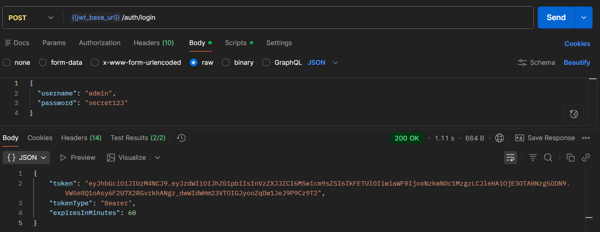
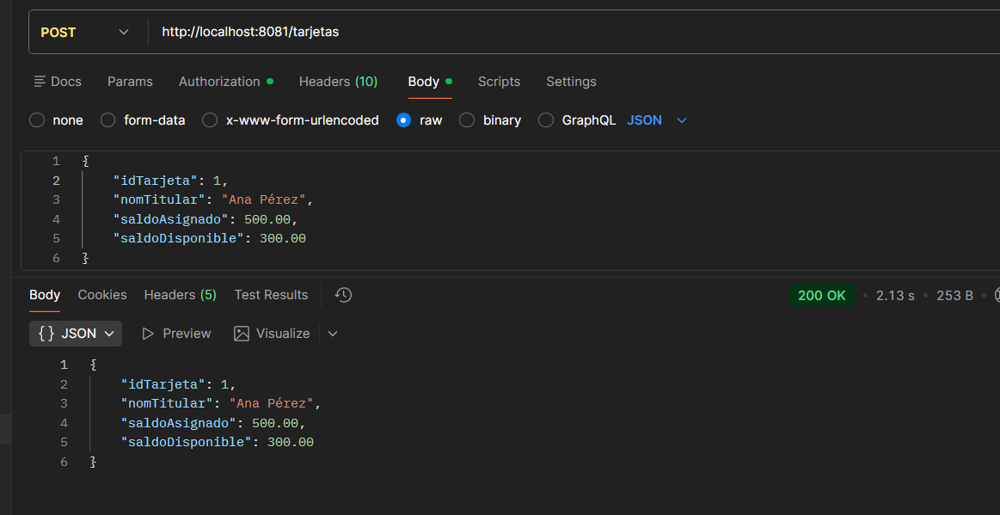
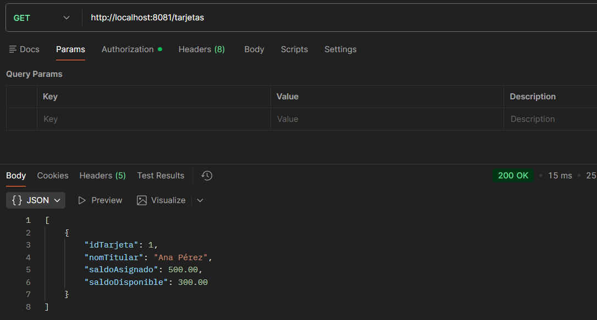
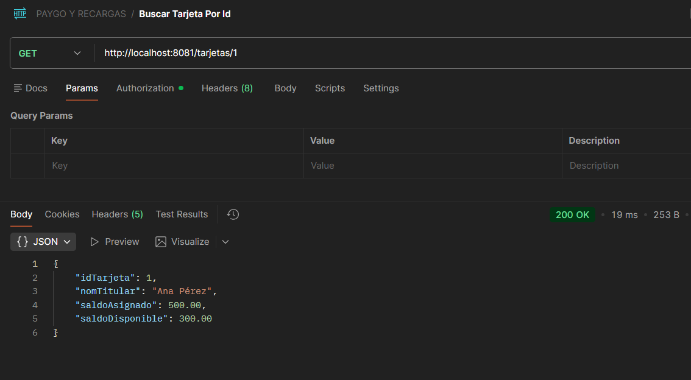
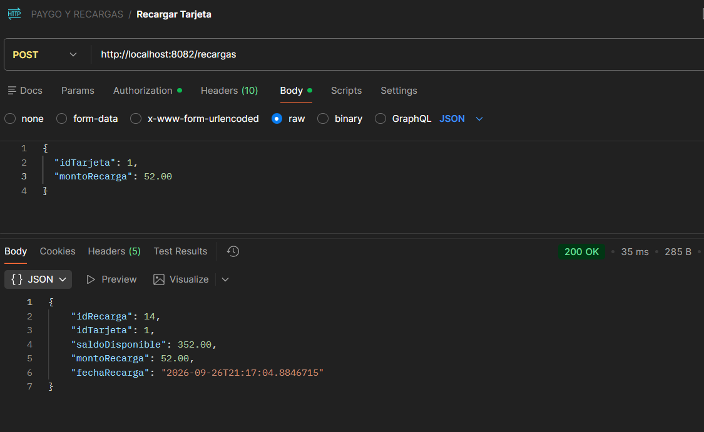
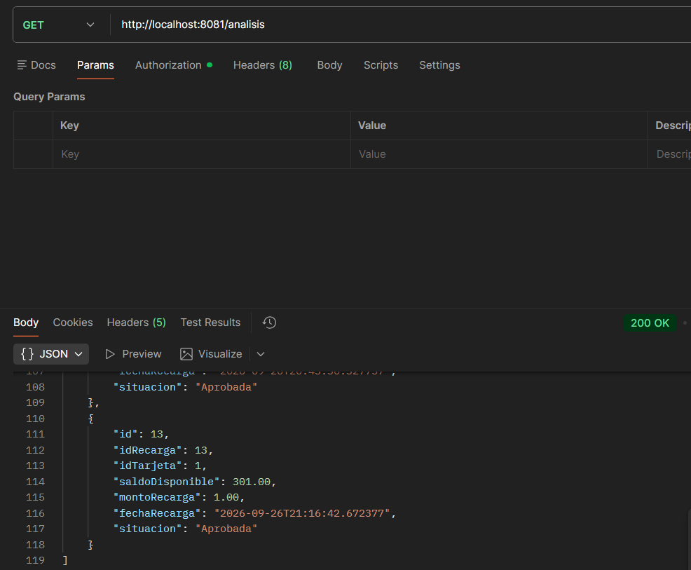

# CASO PRACTICO DE PAYGO PERU

README.md
```
git init
git add README.md
git commit -m "first commit"
git branch -M main
git remote add origin https://github.com/arasn8/DAWII.git
git push -u origin main
```
## Logearse y Obtener Token
Para logearse y obtener el token, el usuario debe ingresar su correo electrónico y contraseña.


## Crear Tarjeta
Para crear una tarjeta, el usuario debe obtener el token.


## Listar Tarjetas
Para listar las tarjetas, el usuario debe obtener el token.


## Listar Tarjeta por ID
Para listar una tarjeta por ID, el usuario debe Obtener el token.


## Recargar Tarjeta
Para recargar la tarjeta, el usuario debe ingresar su número de tarjeta y el monto que desea


## Historial de Recargas
Para ver el historial de recargas.
